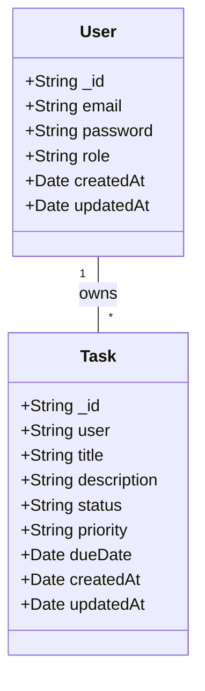
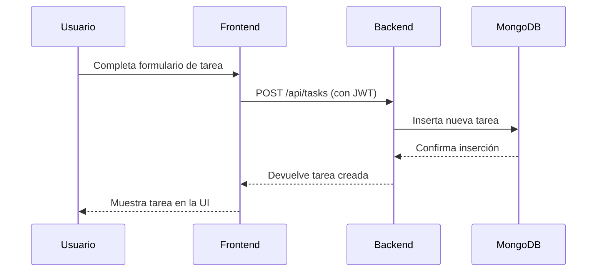

```mermaid
classDiagram
  User "1" -- "*" Task : owns
  class User {
    +String _id
    +String email
    +String password
    +String role
    +Date createdAt
    +Date updatedAt
  }
  class Task {
    +String _id
    +String user
    +String title
    +String description
    +String status
    +String priority
    +Date dueDate
    +Date createdAt
    +Date updatedAt
  }
```

```mermaid
sequenceDiagram
  participant U as Usuario
  participant FE as Frontend
  participant BE as Backend
  participant DB as MongoDB

  U->>FE: Completa formulario de tarea
  FE->>BE: POST /api/tasks (con JWT)
  BE->>DB: Inserta nueva tarea
  DB-->>BE: Confirma inserción
  BE-->>FE: Devuelve tarea creada
  FE-->>U: Muestra tarea en la UI
```
