# Diagramas de Arquitectura y Flujos

Este archivo documenta visualmente la arquitectura y los principales flujos de tu Task Manager Fullstack. Puedes visualizar los diagramas en VS Code con la extensión **Markdown Preview Mermaid Support** o en https://mermaid.live.

---

## ¿Cómo ver los diagramas?

1. Instala la extensión "Markdown Preview Mermaid Support" en VS Code.
2. Abre este archivo y haz click derecho → "Open Preview" o usa el atajo `Ctrl+Shift+V`.
3. También puedes copiar cualquier bloque Mermaid y pegarlo en https://mermaid.live para ver el diagrama online.

---

## 1. Arquitectura General

---

## 2. Flujo de Autenticación (Login)

```mermaid
sequenceDiagram
    participant U as Usuario
    participant F as Frontend (React)
    participant B as Backend (Express)
    participant DB as MongoDB

    U->>F: Ingresa usuario/contraseña
    F->>B: POST /api/auth/login
    B->>DB: Busca usuario
    DB-->>B: Usuario encontrado
    B->>B: Verifica contraseña
    alt Credenciales válidas
        B->>F: JWT Token
        F->>U: Acceso a tasks
    else Credenciales inválidas
        B->>F: Error 401
        F->>U: Mensaje de error
    end
```

---

## 3. Diagrama de Clases (Modelo de Datos)

---

## 4. Flujo de Creación de Tarea

---

Puedes agregar más diagramas según lo necesites (casos de uso, flujos de tareas, seguridad, etc.).
